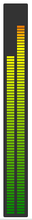

# LED-Audio-Meter
Browser based peak level (VU) meter.

- Mainly CSS, some Javascript and Websocket magic.
- Backend is Python/Flask

(Go see [pcm-peak-level-filter](https://github.com/dagent/pcm-peak-level-filter), which has an example using this which is much leaner and doesn't require socket.io.js or any python.)

## Motivation

I need a way to monitor ALSA capture devices input levels, and I wanted it done in a web browser.  After some exaustive searching, I decided to make my own.

Here's what I've got working in `src/`:

## Requirements
Stilll getting requirements.txt in order and getting rid of devel cruft, but basically:
* flask
* flask-socketio
* pyalsalaudio
* audioop - so useful, but [deprecated beginning 3.13](https://docs.python.org/3/library/audioop.html)

## Python version
Development for this was initiated on a box running Linux Mint 19.3 (for which some hardware has specific drivers), and which has Python 3.6.9 installed.  I've also used it on a Python 3.8 system with no problem.
